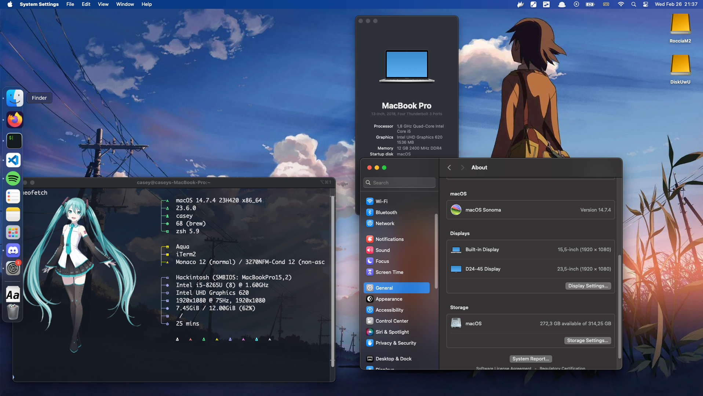

# ASUS-X512FB-EFI

My personal efi for macOS sonoma for the ASUS X512FB

> [!NOTE]
> The base efi is generated by [OC-Simplify](https://github.com/lzhoang2801/OpCore-Simplify), i only add fix where things not work
>
> *One day when i have time i'm gonna do the entire efi from 0*

### Supports macOS Sonoma 14.7.4

# Index
[Specs](#specs)  

[Working Status](#working-status)  

[Know issues](#know-issues)  

[Not tested](#not-tested)  

[Not work](#not-work)  

[Installation](#installation)  

[Post-Installation](#post-installation)  

[To Do List](#to-do-list)

## Specs

|Model|Asus VivoBook 15 X512FB|
|---|---|
|CPU|8th Gen i5-8265U|
|GPU 1|Intel UHD 620|
|GPU 2|Nvidia GeForce MX110
|SSD|Inteno 512 GB M.2 Sata|
|Audio|Realtek ALC256|
|RAM|12GB 2400Mhz DDR4|
|Wifi Adapter|Intel AC-9560|
|Bluetooth|Intel AC-9560|
|Keyboard|Enhanced PS/2 Keybord|
|Trackpad|PS/2 Touchpad|

## Working status

- [x] Triple boot (*Kernel OS 10, macOS Sonoma, PopOS 24.04*)
- [x] Internal Audio and phone jack
- [x] Internal Mic
- [x] iGPU (I disable the dGPU)
- [x] Battery Managment
- [x] Display Brightness with keys
- [x] Sleep
- [x] Wifi + Bluetooth
- [x] Trackpad Gesture
- [x] HDMI (you need to apply this [patch](https://www.reddit.com/r/hackintosh/comments/hu46xm/fix_hdmi_port_and_possibly_others_not_working_on/))
- [x] Native Hotkeys support with Fn keys
- [x] Type C

## Know issues

- Trackpad works with only gesture, for other things is not wort
- The webcam doesn't work (**probably never fix**)
- Sometimes, during the boot the pc display shutoff (**Need a reboot to fix**)
- Some problems with the HDMI hot plug (**Fix soon**)

## Not tested

- [ ] Internal microSD reader

## Not work

- Internal webcam
- dGPU
- Touchpad (50/50)

# Installation

1. Downlad the mac recovery with the [dortania method](https://dortania.github.io/OpenCore-Install-Guide/installer-guide/)
2. Download the efi from the [release page](https://github.com/sayoridev/ASUS-X512FB-EFI/releases)
3. Put the efi and the recovery in the USB
4. Reboot and set the bios option.
5. Boot from usb, select the recovery and start the installation!

# Post installation

1. Download [MountEFI](https://github.com/corpnewt/MountEFI), and copy the efi in to the disk
2. Change the mac serial with [GenSMBIOS](https://github.com/corpnewt/GenSMBIOS) and with this part of the [dortania guide](https://dortania.github.io/OpenCore-Install-Guide/config-laptop.plist/coffee-lake.html#platforminfo)
3. Enjoi your macOS experience!

### To do list
- [ ] Fix webcam
- [ ] Fix Touchpad
- [ ] Rebuild efi from 0